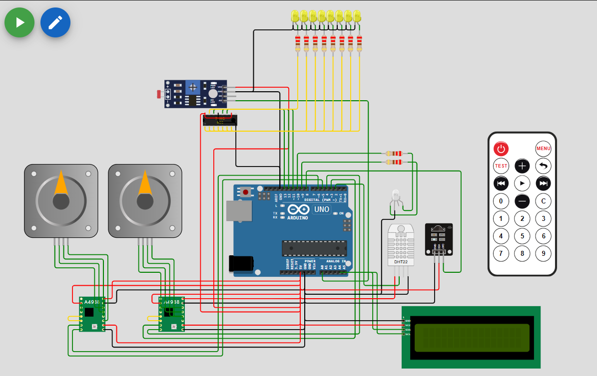
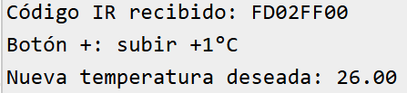

# Sistema de control y actuación en función del clima

## Descripción del sistema

Sistema automatizado para el control climático interior que mide temperatura y luz ambiental para regular la apertura de válvulas de frío y calor mediante motores paso a paso, además de ajustar la iluminación ambiental mediante LEDs controlados con un registro de desplazamiento. El sistema incluye indicación visual por LEDs RGB y permite control remoto vía señal IR para activación y ajustes.

## Estructura del hardware

| Componente             | Descripción                                                       | Conexiones Arduino                          |
|------------------------|-------------------------------------------------------------------|---------------------------------------------|
| Arduino Uno            | Microcontrolador principal                                        | Fuente de alimentación y pines digitales    |
| DHT22                  | Sensor de temperatura y humedad                                   | Pin digital 2                               |
| LCD 16x2 con I2C       | Display para visualización de datos                               | SDA (A4), SCL (A5)                          |
| Driver A4988 (x2)      | Controlador de motores paso a paso                                | STEP (3 y 5), DIR (4 y 6), VMOT, GND, VDD   |
| Motores paso a paso    | Actuadores para válvulas de frío y calor                          | Conectados a los drivers A4988              |
| LED RGB Azul           | Indica activación de la válvula de frío                           | Pin 10 (con resistencia de 220Ω)            |
| LED RGB Rojo           | Indica activación de la válvula de calor                          | Pin 9 (con resistencia de 220Ω)             |
| 74HC595                | Registro de desplazamiento para controlar múltiples LEDs          | Pines digitales (11, 12, 13)             |
| 8 LEDs Amarillos       | Indican niveles de iluminación ambiental                          | Salida del 74HC595 (con resistencias)       |
| Fotoresistor (LDR)     | Sensor de luz ambiental                                           | Entrada analógica (A0)                       |
| Resistencias (220Ω)    | Limitación de corriente para LEDs y control de señal              | En serie con LEDs                           |
| Receptor IR TSOP38238  | Sensor para recepción de señales infrarrojas para control remoto | Pin digital 8                               |
| Mando a distancia IR   | Emisor de señales infrarrojas para control remoto                 | Dispositivo externo                         |

## Organización de archivos

- **MotorPaso.h / MotorPaso.cpp**  
  Control de los motores de frío y calor:  
  - Inicialización de pines y aceleración  
  - Conversión de PWM a ángulo  
  - Movimiento del motor con aceleración  
  - Control de LEDs según actividad  

- **ControlTemperatura.h / ControlTemperatura.cpp**  
  Lógica de control:  
  - Lectura del sensor DHT22  
  - Control proporcional por temperatura  
  - Aplicación de zona muerta  
  - Simulación térmica interna  

- **ControlIluminacion.h / ControlIluminacion.cpp**  
  Lógica y control del sistema de iluminación:  
  - Lectura del sensor LDR para medir la luz ambiental (lux)  
  - Cálculo del porcentaje de iluminación ambiente respecto al objetivo  
  - Control escalonado de LEDs mediante registro de desplazamiento (shift register)  
  - Visualización de datos de iluminación en pantalla LCD  

- **ComunicacionIR.h / ComunicacionIR.cpp**  
  Control remoto vía infrarrojos:  
  - Recepción y decodificación de señales IR con TSOP38238  
  - Interpretación de comandos para ajuste y activación del sistema  
  - Integración con el ciclo principal  

- **sketch.ino**  
  - Inicialización general  
  - Ciclo principal de ejecución  
  - Llamadas a funciones de control y actuación  

---
## Sistema de control y actuación climática con control remoto IR

### Introducción

Se utiliza la librería **IRremote v4.x** para la recepción y decodificación de señales infrarrojas. El receptor IR TSOP38238 está conectado al pin digital **8** del Arduino.

El código ha sido adaptado para ser compatible con la versión 4.x de la librería, evitando problemas de incompatibilidad comunes en versiones anteriores (2.x).

### Funcionamiento

El receptor IR detecta y decodifica los códigos hexadecimales enviados por el mando a distancia.

Actualmente se reconocen dos botones principales:

- **Botón Signo + (0xFD02FF00):** Incrementa la temperatura deseada `tempDeseada` en 1 °C, con un límite máximo de 35 °C.
- **Botón Signo - (0x6798FF00):** Decrementa la temperatura deseada `tempDeseada` en 1 °C, con un límite mínimo de 15 °C.

### Integración en el sistema

Los valores modificados mediante el mando IR son utilizados por la lógica de control de temperatura para ajustar el comportamiento de los motores paso a paso y las válvulas de frío y calor.

Este control remoto proporciona una interfaz sencilla para el usuario, permitiendo la regulación manual sin interferir con el control automático basado en los sensores ambientales.

---